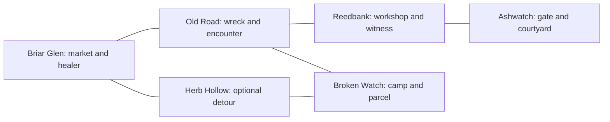

# Living Vale — game and gameplay design

**Status:** companion design draft, 7 October 2026. Start with the
[short build plan](living-vale.md). Names, counts, controls, balance and architecture
sketches are editable proposals, not implemented features.

The user confirmed grounded medieval fantasy, third-person single-player play, a
compact open region, a 20–30 minute first adventure, the RPG systems below, and broad
roleplay/improvisation. Authored main quests, improvised favors, some generated-quest experiments, friendly-NPC
combat with protected essential characters, Windows-only support and no fixed deadline
are also confirmed. Visual style stays open until an asset-generation pilot is reviewed.

## 1. Player fantasy and design pillars

You are an unknown traveler who becomes useful to a small community. You can ask
ordinary questions, bargain, investigate rumors, fight when needed, and decide whom
to help. Residents have occupations, preferences and information that make speaking
to them useful beyond receiving a quest.

Four pillars guide additions:

- **Conversation is an interaction tool.** A request can result in an actual purchase,
  a map lead, permission to enter, a favor or a changed relationship.
- **A small place feels inhabited.** Repeated NPCs, visible routines and local consequences
  build familiarity; distant scenery establishes a larger world.
- **RPG systems support each other.** Exploration finds supplies, supplies affect combat,
  quests reward growth, and social standing changes opportunities.
- **Improvisation has visible boundaries.** NPCs can be playful, evasive, curious or
  cooperative. World changes have explicit game rules and receipts.

Aim for depth in interacting systems. A functioning market, a guarded entrance and
a contested quest create more useful situations than several empty towns.

## 2. The region

Working setting: Briar Vale, a rural border valley under a small castle garrison.
Fantasy appears through ruins, folklore and medicine; casting spells is an expansion.

| Place | Purpose | First-build content |
|---|---|---|
| Briar Glen | Arrival, preparation, community stakes | Market stall, healer's porch, inn exterior and small accessible room |
| Reedbank | Contrasting village with workers and missing supplies | Workshop, farm plots, river crossing |
| Ashwatch Castle | Authority, alternate ending, access negotiation | Silhouette, gatehouse and courtyard; most interior doors closed |
| Old Road | Movement, encounter and clue | Wagon wreck, woodland bend and short ambush area |
| Broken Watch | Recovery/negotiation destination | Ruined wall, camp, recoverable medical parcel and leader |
| Herb Hollow | Side quest and detour | Gatherable plants, one optional wolf encounter and landmark |

Start around 600 × 600 m, then tune by travel time. Adjacent major locations should
take roughly 45–90 seconds to reach by normal movement, with a landmark, resource or
decision on the way. These are initial design targets, not measured results.

Use one continuous playable region with short branches and a loop. Natural boundaries
are river, cliffs, forest density and closed gates. Distant mountains and castle towers
communicate scale without adding accessible acreage. No terrain streaming, procedural
world generation, mounts or extensive interiors in the first slice.



Build routes from primitives first. Test slopes, camera collision, sight lines, navmesh,
interaction distances and landmark visibility before constructing scenery. Divide
authoring into prefabs for each location so one scene file does not become the team's
shared editing bottleneck.

## 3. The first adventure: The Missing Wagon

A wagon carrying medicine never reached the valley. The healer needs it for residents;
the castle expected it for its garrison. The camp leader took shelter in a ruined
watchpost and holds the parcel. The player can learn that story through different NPCs.

| Beat | Approximate place in a first session | Player activity |
|---|---|---|
| Arrive | Minutes 0–3 | Learn movement/chat; hear the problem from healer, trader or innkeeper |
| Prepare | Minutes 3–7 | Buy a potion, equip a weapon, ask for leads, optionally bargain |
| Investigate | Minutes 7–13 | Visit wreck/witness, fight or avoid road enemies, collect herbs |
| Recover | Minutes 13–21 | Reach camp; defeat hostile defenders or resolve a supported exchange |
| Decide and return | Minutes 21–27 | Choose parcel disposition; receive reward and relationship changes |
| Explore afterward | Remaining time | Try side quest, talk about the outcome, visit courtyard, shop again |

Timing is illustrative; free-form conversations will change it. Show a useful destination
quickly and avoid forcing every NPC visit. Newcomers can finish without knowing exact
phrases. Discovery can occur before formal quest acceptance.

### Main quest state

Proposed authoritative states:

`Undiscovered → Offered → Active → ParcelRecovered → Resolved`

Discovering the wreck or finding the parcel early also permits `Undiscovered/Offered →
ParcelRecovered`. Store clues independently so accepting the quest cannot erase prior
discoveries. Dialogue facts do not directly advance a state.

Recovery routes:

- **Combat:** defeat camp defenders, then collect the parcel. Clear telegraphs and an
  approachable difficulty make this feasible with starter equipment.
- **Negotiation:** the leader may release it after a verified herb favor or a fixed,
  affordable supply payment. Their tone and reasoning are improvised; the conditions,
  parcel ownership and exchange amounts are authored.
- **Investigation:** the witness provides an actual clue that unlocks the leader's
  cooperative option. Saying “I have proof” without the fact does not unlock it.

Offer three authored dispositions after recovery: deliver to the healer, deliver to
the garrison, or arrange an agreed division. Division is one code-defined resolution
with fixed effects, not arbitrary percentages extracted from chat. It requires both
parties' game-recorded agreement. Each ending grants base quest XP; gold and social
effects vary. No branch permanently prevents completion of this first adventure.

The player sees the outcome: patients leave the healer's porch, the gate guard allows
courtyard entry, or both factions give smaller benefits after the divided delivery.
Choose affordable visual changes such as actor activation, a changed stall prop,
greetings and an unlocked gate.

### Side quests

| Quest | Objective and alternative | Connection to other systems |
|---|---|---|
| Herbs Before Sundown | Gather three marked herbs and deliver them; no real countdown initially | Healer favor, potion reward, evidence for camp cooperation |
| A Dented Badge | Find a guard's lost badge at the wreck and return it | Exploration, gate goodwill and a new account of the wagon |

These are authored quests. The proposed title “Before Sundown” must not imply a hidden
failure timer; NPC wording should clarify that there is no deadline until one is built.

### Improvised favors

Recommended initial boundary: authored main/side quest states plus improvised
conversation and later template-based favors. Examples are lending an owned item,
taking an already-existing parcel to a named NPC, or asking a nearby villager to guide
the player to a registered landmark.

A favor requires an existing giver, recipient, item/location, executable objective and
funded reward. Game code selects valid combinations and creates a `FavorContract`;
the model may select that contract and describe it. Cap the first implementation at
one active favor, disallow essential quest items, and avoid recursively generating new
NPCs, locations or rewards. A promise made only in prose creates no quest.

The user also wants some generated quests as experiments. Add an opt-in experimental
quest generator after the authored adventure works: assemble a deliver/gather/recover
contract from valid existing NPCs, items and reachable locations, then let the agent select
it and improvise its premise. Require a solvability check, reserved item/reward budget,
a maximum of one active generated contract, an abandonment route, and a saved seed plus
contract version. Show its exact objective and reward in the same quest card. It must not
modify the main quest or invent scene objects. Test at least five generated instances,
including insufficient reward funds, unavailable recipient and save/load. Narrative
novelty and mechanical validity are evaluated separately. Richer generated plots remain
a later experiment with their own acceptance and evaluation work. Broader roleplay can already include asking about customs, arguing
about duty, making jokes, recounting events, seeking advice and negotiating a supported
solution without procedural world construction.

## 4. Player control, camera and combat

Proposed controls: WASD move, mouse orbit, Shift sprint, Space dodge, left mouse attack,
right mouse block, E focus/interact, T open chat with the focused NPC, I inventory,
J journal, 1–3 quick-use slots, Escape close/back. These are configurable bindings;
controller support is deferred until the core input flow is stable.

Use a third-person camera with obstruction handling and readable framing near walls.
First combat pass uses free aiming with soft orientation toward a nearby enemy rather
than a full lock-on system. Add lock-on only if playtests show targeting is frustrating.

Combat is deterministic gameplay, with no model request per attack, dodge or enemy tick.
A small state machine handles idle, pursuit, telegraph, attack, recovery, stagger and
defeat. LLM decisions may later choose surrender or a social response, not hit timing.

Initial tuning proposal:

| Value | Starting point |
|---|---|
| Player health / stamina | 100 / 100 |
| Light attack | 20 damage, 10 stamina, one hit per swing per victim |
| Dodge | 25 stamina; brief invulnerability window verified visually |
| Blocking | Reduces damage, costs stamina; prevents attacking at the same instant |
| Healing potion | Restores 40 health; stack cap five |
| Enemy archetypes | Human melee raider and lunging wolf |
| Encounter size | Usually two enemies; no large battles |

Every hit needs anticipation, contact feedback and recovery. Implement impact sound,
a modest hit flash, health feedback and stagger before adding new weapon types.
Avoid weapon durability, limb damage, elaborate combos and physics ragdolls initially.

On player defeat, respawn at the latest visited settlement with a modest gold penalty.
Keep equipment and quest objects. Fail/cancel pending interactions and reset nearby
combat fairly; previously committed quest outcomes persist. The respawn point must
remain accessible regardless of chosen ending.

Friendly-NPC combat with consequences and protected quest characters is confirmed.
Residents are attackable, with deterministic hostility, witnesses and guard intervention. Essential
characters become incapacitated and recover; they cannot permanently remove the only
way to finish. Drawn weapons alone do not punish a player who has just left a fight.
No conversation input is allowed to accidentally trigger an attack.

## 5. Inventory, equipment and economy

Use 16 general slots, stackable consumables/materials, one weapon slot, one armor slot
and three quick-use assignments. Quest items use protected storage and cannot be sold,
dropped or destroyed. All objects have stable content IDs; scene/display names do not
serve as IDs. No carry weight or crafting in the first build.

Proposed 12 item definitions: starter sword, iron sword, sturdy sword, traveler armor,
padded armor, healing potion, bread, herb bundle, iron scrap, wolf pelt, lost badge and
medical parcel. Shared models/icons and color variants keep the catalog affordable.

The UI supports inspect, equip, use, rearrange and drop ordinary items. Chest/loot
interaction is direct gameplay; only interacting with people uses the chat channel.
Show quantity and equipment changes immediately after a committed operation.

Use integer gold and deterministic price tables. As initial tuning, start at 40 gold,
a potion costs 10 and an iron sword costs 30; purchasing a potion then a sword is
possible, but exploring should create additional choices. Sale prices are below
purchase prices at every reputation tier to prevent buy/sell arbitrage. Round prices
consistently and enforce a minimum of one.

Stock is finite during the first adventure. Save it; no reload restock exploit.
Required medicine is never gated behind an endlessly sold-out vendor. Haggling selects
one allowed discount tier, with a per-offer/session limit. Charm may unlock a tier;
repeating flattery cannot stack discounts.

Currency, item capacity, ownership and availability are checked at commit time.
Purchases and sales are atomic: all transfers occur together, or none occur.

## 6. Levels and player growth

Start at level 1. Proposed cumulative XP thresholds are 100 for level 2 and 250 for
level 3. The main quest's base reward is 120 XP, so any completed route offers at least
one level-up without grinding. Side quests, discoveries and capped encounter rewards
make level 3 available to thorough players.

Each level grants a small health increase and one choice among:

| Perk | Effect |
|---|---|
| Hardy | More survivability |
| Skirmisher | Reduced dodge stamina cost |
| Trusted Face | Unlocks one bounded bargaining/favor condition |

Names and values are provisional. The social perk changes game conditions, not a hidden
promise that the model will be more accurate or persuasive. The quest remains completable
without it. XP is awarded for actual recorded events, not repeated chat, replayed dialogue
or farming a respawned protected NPC.

Show level-up feedback without interrupting combat. Let the player pick a perk afterward.
Persist XP and selected perks; repeated reward events are idempotent.

## 7. Eight NPCs with distinct roles

| NPC / stable ID | Role and personality | Knows | Supported contribution |
|---|---|---|---|
| Mara / `npc_mara` | Practical general trader, protective of her stock | Local shortages, prices, rumor source | Buy/sell quotes, bounded haggling, directions |
| Iven / `npc_iven` | Quiet healer, concerned with residents | Medicine need, herb locations, patient outcome | Main/side offers, verified deliveries, information |
| Sella / `npc_sella` | Sociable innkeeper with selective gossip | Travelers and public events | Leads, roleplay, optional rest |
| Toma / `npc_toma` | Blunt Reedbank smith | Equipment and road damage | Gear sale, appraisal, workshop directions |
| Fen / `npc_fen` | Cautious farm worker and witness | What was seen at the wagon | Verified clue, landmark guidance |
| Brann / `npc_brann` | Dutiful gate guard, wary of strangers | Gate policy and badge | Permission, directions, warning/surrender interaction |
| Elra / `npc_elra` | Castle steward balancing competing duties | Garrison needs, agreed division terms | Quest resolution, reward and castle standing |
| Kest / `npc_kest` | Defensive camp leader, distrustful of authority | Why the parcel was taken | Negotiated recovery, refusal, surrender |

NPC identities contain concise personality and goals. NPCs know their own role, relevant
local facts and observed events; they do not receive the entire quest database or another
NPC's private motives. Unknown information may produce an honest uncertainty or a pointer
to someone who knows.

Use shared humanoid rig/animation sets and recognizable silhouettes/outfit accents.
Not every NPC needs unique geometry. Two or three routine waypoints per settlement and
idle work animations can communicate life before implementing a clock.

Deterministic routines handle walking, work, idle and reacting to nearby threats.
During a valid conversation the NPC faces the player and pauses routine movement.
Combat or departure cancels the interaction. Later day/night schedules need recovery
rules for finding a quest giver; no main quest depends on catching a five-minute window.

Reputation begins as two settlement/faction tracks plus small per-NPC relationship flags.
Authored witnessed actions, completed favors and validated social handlers change them.
Model-written compliments or threats alone do not silently change numeric reputation.
A specific social action, such as warning a guard or issuing a supported threat, can
produce an event with capped effects and a cooldown. Only witnesses and designated
information-sharing events propagate knowledge; the valley does not become omniscient.

## 8. Chat interface and interaction rules

The main interface remains the world. Chat is a compact overlay with NPC name, recent
exchanges, input box and optional inline information/offer card. No dialogue tree,
fullscreen shop panel or portrait scene is required.

```text
[Third-person world remains visible]

Mara — General trader
You: I need something to keep me alive on the road.
Mara: A potion is a sensible start.

Healing potion ×1 — 10 gold     Your gold: 40
[Buy for 10 gold] [Decline]

[Type to Mara…] [Send]          Esc: close
```

This is an illustrative interaction, not a measured evaluation prompt or fixed NPC line.
The game-owned card gives exact amounts; the purchase receipt confirms the actual change.

Flow: focus one nearby speaking NPC → open chat → submit one turn → show pending feedback
→ receive a validated decision → execute a supported handler → show its result → continue
or close. One request at a time per conversation; no silent piling up of typed turns.

A speaker stays locked until the player explicitly ends or switches conversation.
Initial range proposal: start within 3 m with clear line of sight; cancel beyond 6 m.
The NPC's role permits remote information about known locations, not remote manipulation
of objects anywhere on the map.

Typing captures movement and combat input. Chat closes on damage, hostile escalation,
death, scene transition or explicit exit. The world keeps running; initially refuse to
open chat during active combat. Threats can start combat only after the input focus closes
and the game records the escalation.

Show “Waiting for a reply” quickly. Proposed total turn timeout is eight real-time seconds,
including queue time; cancel/close stays available. The correct value is measured later.
Never accept partial streamed text as an executable action. On failure, use a short
game-authored availability line and allow retry.

Every speaking NPC supports general conversation, normally `none / no_target` with a
statement. Unsupported interactions should be understandable in the NPC's voice. “Can
you build me a castle?” can produce roleplay, but cannot create a building or consume gold.

Accessibility baseline: scalable text, good contrast, keyboard navigation, scrolling
history, reduced camera shake, visual cues for critical audio, and adjustable sensitivity.
Use text first; generated voice and speech input are optional later work.

## 9. Chat-driven trading without changing the framework schema

Current `AgentDecision` contains only `ActionId`, `TargetId` and `Statement`.
There are no structured quantity, price or general parameter fields. The first game
must work within this contract rather than parse commands from free-text statements.

Proposed approach: game-owned typed targets for catalog entries, sale bundles, quotes,
knowledge cards and quest/favor contracts. A target ID such as `stock_mara_potion_one`
resolves to an existing object containing item and quantity. A handler reads that object
and computes a quote. These are not new framework decision fields.

### Purchase or sale

1. Submit free-form request to the addressed trader. Its sources expose only a small,
   current catalog and sellable inventory bundles.
2. The model chooses `quote_purchase` on a stock entry or `quote_sale` on a sale bundle.
   A handler verifies the target's type, owner and current applicability.
3. Game code creates a `TradeQuote`: unique ID, conversation ID, NPC, direction,
   exact item/quantity, integer total, stock/inventory revision, expiration and state.
4. Chat shows an inline card, with exact totals and an explicit transaction button.
   No inventory mutation has occurred yet.
5. Confirmation invokes the game's transaction service directly for that quote.
   It re-checks range, session, hostility, ownership, capacity, balances, stock and
   revisions; transfers atomically; marks the quote consumed; produces a receipt.
6. Refresh observations from the resulting state. The following turn knows what happened.

Confirmation is an ordinary in-game control, not an assistant permission question.
A plain conversational “yes” need not trigger another inference request: optionally
accept an exact reserved input such as `/confirm` when precisely one visible quote
is pending. Show that affordance explicitly; do not use a fuzzy parser that interprets
“yes, but later” as consent.

Initial catalog bundles are one potion and one weapon. Later expose bundles of one,
three or five units, bounded by stock. Arbitrary quantities are a future UI/parameter
design; do not pretend the present schema already supports “37 potions at 12 gold each.”
If quantity ambiguity occurs, show valid inline bundle choices and let the player select
one. A selected bundle updates the game session, not the model's response shape.

### Negotiation and errors

`offer_discount` targets a currently pending quote and selects the next legal discount
tier; it cannot invent a new number. Invalidated quotes disappear from sources. Game
code replaces the card and prevents confirmation of its old revision. There is a
strict lower price bound and negotiation count; reputation/perks determine eligibility.

An unknown item is not substituted with the closest stocked item. Keep grounding enabled
under the current DR-016 strategy and still use exact confirmation to expose the selected
item. The guard cannot guarantee semantic correctness; the player should see what they
are buying.

A stock item selected with a quest action, a quote selected with a direction action, or
another vendor's bundle is rejected by target-type/ownership checks. One global target
enum is not assumed to enforce valid action-target pairs.

No handler evaluates C#, console commands or JSON embedded in `Statement`. Prices and
quest rewards mentioned there are not authoritative. If the text contradicts a card,
the card/receipt remains correct; record the contradiction for testing rather than
claiming all prose can be automatically grounded.

## 10. Proposed registered actions

Keep each NPC's own action set small. IDs and handler names below are proposed demo data;
`none` is the framework's fallback, not an action the game registers.

| Action | Target object | Availability and deterministic effect |
|---|---|---|
| `share_information` | `KnowledgeCard` | NPC knows the fact; reveal a factual card, optionally a map pin/clue |
| `quote_purchase` | `StockEntry` | NPC sells the entry; produce exact quote without transferring items |
| `quote_sale` | `SaleBundle` | NPC buys that kind of player-owned item; produce sale quote |
| `offer_discount` | `TradeQuote` | Active quote and eligible remaining tier; replace quote |
| `offer_quest` | `QuestOffer` | Available authored contract; show offer card |
| `offer_favor` | `FavorContract` | Existing legal template instance; show optional favor card |
| `resolve_delivery` | `DeliveryContract` | Correct item/stage/recipient; atomic hand-in and one-time reward |
| `grant_access` | `AccessGrant` | Conditions true; unlock only its specific gate/access flag |
| `guide_to` | `KnownLocation` | Nearby guide willing and path valid; start deterministic guidance |
| `issue_warning` | `SocialInteraction` | Relevant conflict and cooldown; record bounded warning/consequence |
| `surrender` | `EncounterContract` | Human character can surrender in the present encounter; stop fighting |

Quest/favor acceptance can use a small inline accept control against the displayed
contract. A natural-language request may cause the NPC to offer it; the game handles
acceptance using the precise contract. Delivery and access effects must independently
revalidate even when model output is schema-legal.

If an action has no eligible targets, omit that action from availability. A trader
whose sale is impossible cannot execute it. Target lists can still include entries
for browsing/quoting where meaningful; show affordability on the quote.

Unsupported compound requests receive at most one action per turn: “sell my pelts and
buy armor” becomes an offered sale followed by a purchase. The game does not unpack
multiple commands from prose or silently run an LLM-planned sequence. Let the NPC
acknowledge the remaining request.

## 11. Observations, targets and memory

Build concise role-specific observations at decision time from canonical state:

- Relevant NPC role, relationship and local events.
- Current quest stage and verified clues this NPC knows.
- Current visible quote and exact terms, when any.
- Stock/bundles, available services and relevant player holdings.
- Last committed interaction outcome and any rejection reason.
- A few nearby or known locations appropriate to this role.

Use IDs verbatim with short names/descriptions. Do not send all inventory, terrain,
hidden quest flags or every resident's history on every request. Proposed initial
budget: 12 targets and a short role-specific fact list; measure and adjust within the
framework's actual token caps. Catalog pagination or inline category selection should
change the game-owned source window explicitly, rather than request a model to guess
which unlisted items exist.

Scene objects can use `Targetable` and proximity discovery, but trade/quest targets
are ordinary typed objects from `ExplicitTargetSource` or a demo-owned `ITargetSource`.
Proximity's registered `Transform` must not be cast into a `TradeQuote`. Keep IDs
unique across composed sources; a duplicated ID is a configuration error.

Short conversation history belongs to one agent instance. Persistent facts belong to
the game's event/quest/relationship state. A profile shared by NPC instances is never
their shared memory.

After a failed execution, current observations must say the purchase/hand-in did not
occur even if the earlier decision selected it. Preserve the framework's memory
contract when it lands; do not invent a new `DecisionRequest.History` encoding now.
If memory export/import is not public, clear rolling history on load and supply
canonical facts and an explicit fresh-session context. Do not use private fields.
Persistent free-form conversational recall is an extension, not promised in v1.

## 12. Asynchrony and execution receipts

Use a monotonically increasing conversation generation alongside request IDs.
Every response is checked against the current NPC, conversation generation and world
revision before it is allowed to execute. Closing chat, changing NPC, loading a save,
respawning or starting combat cancels the request and invalidates that generation.
Cancellation alone is insufficient because a backend can still finish.

The provider/model chooses; framework validation and the game's handlers independently
check legality. A valid decision only requests an operation. Successful execution is
what creates a committed event.

A demo-owned `InteractionReceipt` records request/quote/contract ID, applied or rejected
result, reason, and authoritative changes. It complements framework decision telemetry;
it does not pretend that selecting an action proves its gameplay effect succeeded.
Quest rewards and transactions use unique event IDs to prevent double application.

If the framework's `Execute` returns no structured result, handlers report their
receipt to the game-owned interaction coordinator. Do not assume the future API already
returns a receipt. Refresh world state before displaying success.

Stale offers are rejected, never silently recalculated and charged. A new quote requires
a new visible confirmation. Escaped, destroyed or incapacitated NPCs cannot receive a
late instruction. A model-selected statement rewritten by a guard is replaced with the
game's reason-aware line so the NPC does not claim to have performed the blocked action.

## 13. Game architecture and persistence

Keep gameplay state testable apart from presentation. Proposed structure:

```text
Demos/LivingVale/Assets/LivingVale/
  Game/         inventory, trade, quests, progression, relationships, events
  Interaction/  sessions, typed targets, sources, receipts, brain boundary
  Agenerela/    public-API adapter, registrations, role observations
  Unity/        controllers, NPC navigation/views, authoring and scene hooks
  UI/           chat, inline cards, HUD, inventory, journal
  Content/      item/NPC/quest definitions and balance data
  Scenes/       bootstrap and region
  Art/ Audio/ Prefabs/
  Tests/Editor/ Tests/PlayMode/   separate test assemblies
```

This layout is for the demo, not new framework modules. Game code may touch Unity scenes;
the framework's own scene-boundary rule continues to apply only to its runtime package.

Proposed `INpcDecisionDriver` is a game boundary with asynchronous decide and separate
apply/execute. `ScriptedNpcDecisionDriver` produces fixture decisions and injected delays;
`AgenerelaNpcDecisionDriver` delegates to the eventual public API. Both must invoke the
same game transaction/quest services. Never copy the framework's schema, prompt builder
or guards to make the placeholder look complete.

Minimal service responsibilities:

| Service | Owns |
|---|---|
| Inventory/equipment | Item instances, stacks, slot/capacity and equip rules |
| Trade | Quote lifecycle, exact integer prices, atomic transfers |
| Quest | States, clues, valid contracts and one-time rewards |
| Progression | XP thresholds, perks and reward idempotency |
| World events/relationships | Witnessed facts, faction standing and bounded consequences |
| Interaction coordinator | NPC focus, requests, cancellation, current offer and receipts |
| Save | Versioned canonical state and restore validation |

Save to the game's normal persistent-data location, not its source assets. Use a versioned
format with stable NPC/item/quest IDs, player position/health, inventories, gold, XP/perks,
quest state, clue/event flags, vendor stocks, access flags and relationships. Write
atomically and retain a previous valid save. Failed load must offer recovery or a new
game rather than corrupting the active session.

Do not persist in-flight requests, active quote confirmations or Unity object references.
On load rebuild actors and registries, invalidate old conversation generations, then
restore canonical state. Save after major committed events and on explicit save; avoid
saving half a transaction. Unresolved essential characters restore to recoverable states.

## 14. Test and showcase scenarios

Use different utterances for few-shot demonstrations and held-out evaluation. The
illustrative prose in this document is not automatically eligible for both sets.
Exact examples become evaluation fixtures only after checking training/example overlap.

| Scenario family | Required outcome |
|---|---|
| Ordinary roleplay | Coherent reply without invented world mutation |
| Purchase/sale | Correct visible offer, exact confirmed transfer and receipt |
| Compliment about merchandise | No automatic purchase from “nice sword” wording |
| Unknown item/person | No executed substitution; clear refusal or clarification |
| Ambiguous quantity | Supported bundle choice or clarification, no arbitrary quantity |
| Wrong action-target pairing | Typed handler rejects without mutation |
| Multi-turn reference | Correct same-NPC follow-up where resolvable; clarification otherwise |
| Compound request | One operation at a time; no hidden second transaction |
| Quest before acceptance | Discovered clue/parcel preserved and resolution remains reachable |
| Repeat turn/confirmation | No duplicate transfers, rewards or XP |
| Depart/switch/die/load while pending | Late response has no gameplay effect |
| False claim/instruction injection | No grant of nonexistent funds, facts, items or unauthorized actions |
| Quest branch/load | Ending and world changes persist; other valid route works from a fresh save |
| Provider failure/queue delay | Recovery UI, no automatic success and no fallback mislabeled as AI |

EditMode tests target state invariants and atomicity, not exact prose. PlayMode tests
cover input focus, scene lifecycle, navigation and interactions. A built-player pass
covers provider packaging, stripping and performance that Editor tests cannot prove.

Evaluate action choice, execution containment and free-text factual consistency
separately. Deterministic tests should have zero invariant violations; model accuracy
is measured and reported, not assumed to reach the prototype's number. A/B runs use
the same model, hardware, scenario states, prompts and session; only the tested arm
changes. Unload other inference models before timing, coordinate the shared GPU, and
record new measurements in [findings](../llm-wiki/findings.md) that day.

Presentation route: talk to healer → buy through chat → ask witness → encounter/camp →
recover and choose ending → hand in → show level-up and NPC reaction. Keep a fresh-save
reset plus presentation-only checkpoints. A small optional debug overlay shows selected
action/target, guard result, execution result, queue time and request time. The player
UI uses ordinary language.

## 15. Performance, production risks and expansion

Confirmed target: Windows desktop only, with no fixed deadline. Proposed performance
goal: 1080p at 60 FPS, with a usable 30 FPS quality fallback. Exact hardware is pending. Measure frame-time percentiles and peak VRAM with runtime
inference resident, not only an empty Editor scene. Record queue wait separately from
generation and execution latency.

Only the addressed NPC normally requests a model decision. Routine movement, enemy AI
and background population do not continuously prompt the model. Add background social
decisions later with explicit background priority and a measured request budget.

| Risk | Early mitigation and trigger to revisit |
|---|---|
| Large RPG consumes framework schedule | G1–G4 remain small; evaluate at G6 before major polish |
| Improvised promises exceed executable actions | Typed contracts/cards and authoritative receipts; track factual contradictions |
| Model maps wrong legal target | DR-016 grounding plus explicit offer visibility and game rechecks; held-out cases |
| Generated characters cannot animate | Shared proven rig and animation pilot before custom humanoids |
| GPU contention | Offline generation separate from runtime inference/testing; shared-machine coordination |
| Long waits make chat awkward | One pending turn, cancel, visible wait and timed recovery; measure actual latency |
| Player violence strands a quest | Protected essential NPCs/recoverable quest objects or an explicit alternate design |
| Too many parameters for current schema | Fixed typed bundles/contracts; treat generic parameters as future API work |
| Save/reload duplicates rewards | Stable event IDs, atomic writes and loaded-state validation |

Expansion order after v1: one companion using supported follow/wait/help actions; an
additional quest arc; constrained favors; bow or small magic set; richer routines;
castle rooms; then voice. A companion is valuable for demonstrating remembered orders,
but it adds navigation, combat assistance, lifecycle and memory requirements, so it is
not essential to the first adventure.

## 16. Framework questions exposed by this demo

These are integration questions, not instructions to change settled framework rules.

1. **Current execution context:** #17 must make execution-time rechecks possible.
   Handlers will still validate live game state for stale stock or a departed NPC.
2. **Action-target compatibility:** §2.2 already identifies the missing category/pair
   design. Use demo handler type/owner checks until a measured framework solution lands.
3. **Execution result visibility:** decision telemetry and actual gameplay receipts differ.
   Determine whether public execution feedback is needed after the demo exercises it.
4. **Memory after execution failure:** supply canonical outcome observations and inspect
   public memory behavior; a selected trade is not proof that a trade occurred.
5. **Lifecycle/timeout telemetry:** record demo cancellation reasons separately if the
   framework's current `DecisionOutcome` cannot represent them.
6. **Memory persistence:** export/import is explicitly deferred in §2.9. Do not use
   internals to save it; restore game facts and clear short-term history initially.
7. **Empty target contract:** hard rules require `target` with `no_target`, while the
   plan's Phase 1 table and `ITargetSource` comment describe removing `target` for an
   empty registry. Resolve that inconsistency in #8 before integration; this game
   follows the hard rule and does not invent an exception.

## 17. Questions for the next design revision

- Should this become the existing planned `CompanionRPG` or a separate demo under #47?
- How prominent should optional generated quests be after the authored adventure works?
- Which exact hardware and rig/animation sources are available?
- Which visual style wins the ComfyUI/Unity asset pilot?
- Is typed chat sufficient for v1, and are inline exact-offer confirmations acceptable?
- How much fantasy should become mechanics: grounded medicine/folklore first, or magic
  combat already in the first adventure?

The [asset pipeline](living-vale-assets.md) records the planned Docker/ComfyUI setup.
All provisional mechanics can change before G0 closes. Once implementation choices
cost more than an hour to reverse, record their rationale in the framework build
plan's §7 as the repository requires.
