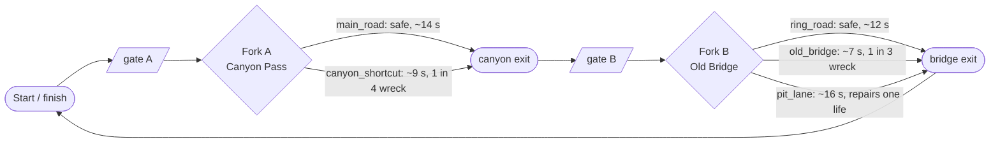
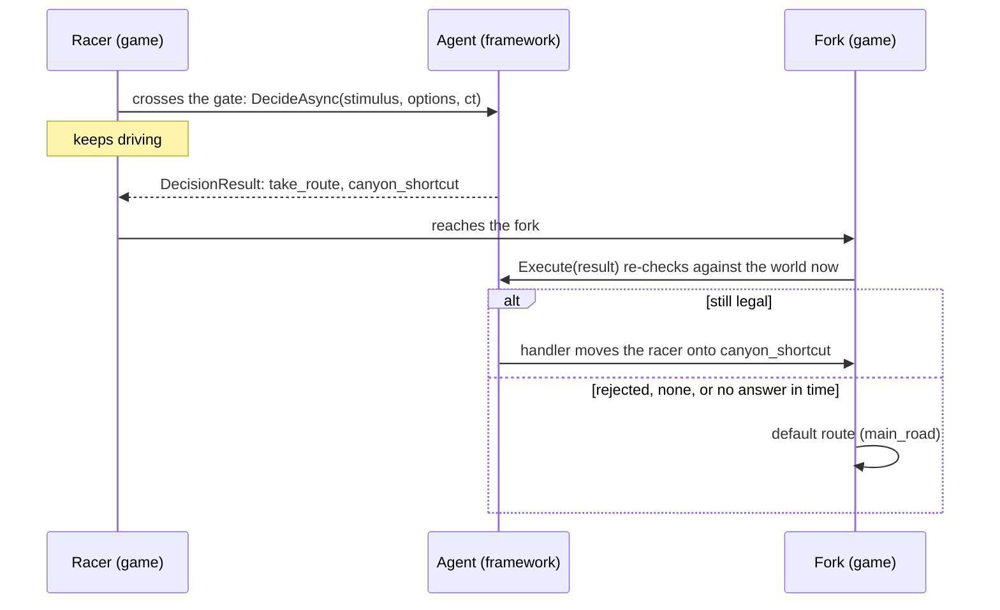

# Risk race — a 3D racing demo where agents choose how much to risk

**Status:** an idea, recorded 23 September 2026. Nothing is built, and nobody has
committed to building it yet. Tracked in #53, a sub-issue of #47.

> **Decided:** it is a 3D game, and its racers' agents choose how much to risk.
>
> **Not decided:** the name, and every mechanic on this page: the track, the forks, lives,
> hazards, the pit lane, the racers and all the numbers. They are one sketch of how the idea
> could work, written down so there is something concrete to change when the game is picked
> up. *RiskRace* is only a placeholder for folder and assembly names.
>
> Where the sketch relies on a settled rule, the rule comes from
> [the build plan](../FRAMEWORK_BUILD_PLAN.md) and its decision records, not from this page.

## In plain terms

Four AI racers drive three laps of a grey-box track. The track splits at forks. One branch
is long and safe. The other is shorter and can wreck you: falling rocks in a canyon, a
bridge that can give way under you. Each wreck costs a life, and the last one takes the
racer out of the race. A few seconds before each fork, each racer's agent answers one
question: *which way?* Ordinary game code does the driving.

The right answer depends on the race and on who is asking. A leader on the last lap has no
reason to gamble. A racer in last place with lives to spare has every reason to, and one
with a single life left should think hard. Each racer also has a personality (reckless,
careful, calculating), so the same fork in the same standings should read differently to
each of them.

The player starts as a spectator. A HUD shows which racer is deciding and for how long,
what each one chose, and a feed of their radio lines. Later the player gets a team radio to
shout at one racer, who may ignore them.

## What it proves that the other demos don't

| Demo | Its agent | When the agent is asked | Does the world wait for the answer? |
|---|---|---|---|
| GreyBoxVillage (#19) | a guard | the player types | Yes. The player waits for a reply |
| GreyBoxStrategy (#20) | a country | once a turn | Yes. The turn ends when every country has decided |
| **Risk race** | a racer | a few seconds before each fork | **No. The racer keeps driving** |

It is the first demo where the answer has a deadline. That gives it four things to show:

1. **Answers with a deadline.** The game asks early, gives the answer a time budget, and
   falls back to a fixed default if the answer is late. The framework's latency, about
   1–3 s a decision (build plan §5) and about 21 s for 30 agents in one queue (§2.6), stops
   being a number in a table. A spectator can watch it happen.
2. **Stale decisions.** The world changes between the question and the fork: a rockfall
   closes the canyon. `Execute` re-checks the decision before any handler runs (hard rule 5,
   #17), and here that re-check visibly saves a racer.
3. **Several agents asking at once.** On lap one, all four racers reach the first fork
   together. The queue (§2.6) serialises them, and DR-015's priority tiers get their first
   real test.
4. **Risk as a judgement.** The choice depends on standings, lives, laps left and
   personality. That is what the framework offers in place of a hand-written condition tree
   (§5), and a race shows it plainly: everyone can see who took the shortcut.

## The game — a first sketch

None of this section is decided. It makes risk a choice through routes at forks, which is
one way to do it; the open questions at the end name another.

### One lap



- **Four racers, three laps, three lives each.** A race lasts about two minutes.
- **Driving is deterministic.** Each racer follows its current route's waypoints at its own
  base speed, somewhere between 11.5 and 12.5 m/s so the pack spreads out. There is no
  physics driving and no steering by the agent.
- **A wreck** costs a life and 4 s at the roadside, after which the racer carries on from
  the end of that route. Losing the last life takes the racer out of the race. This is the
  route where you can get killed.
- **Rockfall.** At seeded moments the canyon closes for 15 s. A closed route is *absent*
  from the choices, not forbidden in prose (a settled rule: availability comes from state).
- **The pit lane** is offered only to a racer that has lost a life.
- **Result:** finishers in finishing order, then eliminated racers, last out ranked highest.

Every number here is a starting value. Tune it in the grey box until the risky route pays
off sometimes, but not every time.

### The dice are seeded

Every hazard roll is a hash of *(race seed, racer, lap, fork)*. It is not the next number
from one shared random generator. Two races with the same seed therefore roll the same dice
for the same racer at the same fork, even when the racers decide differently and arrive at
different times. That is what lets a race run with one configuration be compared with a race
run with another on identical luck: hard rule 2's "same prompt set", applied to a
simulation.

## Where the framework comes in, and where it doesn't

The agent chooses a route. Everything else is game code: movement, hazards, lives, lap
counting and the fallback. The model never touches Unity (hard rule 5).



1. The racer crosses the fork's **decision gate**, a marker about 60 m before the fork,
   which is about 5 s at racing speed.
2. The game calls `DecideAsync` with a stimulus naming the fork and its open routes, the
   observations below, and a cancellation token that the game cancels if the racer reaches
   the fork first.
3. The racer keeps driving, and the HUD shows *deciding… 1.8 s*.
4. At the fork, if an answer has arrived, the game calls `Execute`. It re-checks the
   decision against the world as it is now and, if the decision passes, runs the handler,
   which puts the racer on the chosen route.
5. Otherwise the racer takes the fork's default route, which is always the safe one. That
   covers three cases: no answer in time, the agent chose `none`, or `Execute` rejected
   the decision. The HUD says which one happened.

**Why not pause the race while the agents think?** Pausing would hide the one thing this
demo exists to show. A slow-motion key for the presentation is fine. Pausing for every
decision is not.

## The four design questions

These are the questions #19 and #20 answer for their games, answered here for this one.

### 1. When does the game call `DecideAsync`?

Once per racer, at each fork, on every lap, when the racer crosses that fork's decision
gate. Two forks over three laps makes 6 decisions per racer and 24 per race.

Nothing else asks in the first version. There is no idle timer and no polling every frame.
The team radio adds a second, player-facing moment in step 3.

Priority (DR-015): once the radio exists, fork decisions should go in as *background*, so
that a player's radio message overtakes them. Whether two tiers are enough once four racers
have deadlines is the question DR-015 itself says to revisit, and this demo is where it gets
answered.

### 2. What observations does it pass?

These are the literal lines for Juno at gate A on lap 3:

```text
Lap 3 of 3.
You are 3rd of 4, 2.4 seconds behind Vex in 2nd.
You have 2 of 3 lives.
Moss wrecked in canyon_shortcut on lap 2.
main_road takes about 14 seconds and is safe.
canyon_shortcut takes about 9 seconds; about 1 in 4 racers wreck there.
```

The stimulus is `Race: "Fork ahead at Canyon Pass: main_road or canyon_shortcut."`. Its
label, `Race`, is a free string that the game chooses (DR-008).

- **Route ids appear verbatim**, never paraphrased. The grounding guard is lexical (§2.5).
- **A closed route appears in neither the stimulus nor the choices.** A single line says
  "The canyon is closed by a rockfall", without the id.
- **Keep it short:** six to eight lines. Observations are the last thing the model reads,
  and the framework caps them (§2.8).

### 3. What actions does a racer have?

| Action | Target | Offered when | What the handler does |
|---|---|---|---|
| `take_route` | one of the fork's open routes | at every fork | Puts the racer on that route at the fork |
| `pit_stop` | `no_target` | at Fork B, and only if the racer has lost a life | Sends the racer down `pit_lane`, which is slow and restores one life |
| framework `none` | `no_target` | always, listed last | Nothing, so the racer takes the fork's default route |

The descriptions are one short clause each, of similar length (§2.2's symmetry rule):
*"Drive the named route at the fork ahead."* and *"Enter the pit lane to repair a life."*

This one game exercises both kinds of masking. An action appears or disappears
(`pit_stop`), and so does a target (a closed `canyon_shortcut`).

The targets come from the fork ahead, not from whatever is near the racer. They are "the
open routes of the next fork". That uses DR-014's custom-source path (#32), not the default
proximity query.

### 4. What is the racer's `statement`?

A radio line, shown in the race feed: `Vex: "Canyon. Don't wait up."`. It is flavour only,
and the race runs the same without it. An empty statement is therefore fine for this agent,
and #8 decides whether the schema allows one.

## The racers

| Racer | Personality | Goals |
|---|---|---|
| **Vex** | Reckless and proud; cannot stand being behind anyone | Win, or wreck trying |
| **Moss** | Careful; losing a life feels like losing the race | Finish every race |
| **Juno** | Calculating; takes a risk only when the numbers say it pays | Win on the last lap, not the first |
| **Rook** | A nervous rookie, desperate to impress | Beat Vex, just once |

These fill `AgentIdentity`'s `Name`, `Personality` and `Goals`, with `Role` set to
"Racer" for all four. The placeholder rules below say what we *expect* each racer to do.
The real agents are allowed to surprise us, and the demo is better when they do.

## The placeholder brain (before Phase 2)

The grey box needs a decision at the point where the real call will go, just as the
village's placeholder string matching sits where the guard's call will go.
`PlaceholderRacerBrain` answers from fixed rules:

- **Vex:** always the risky route.
- **Moss:** always the safe route, and the pit lane whenever it is offered.
- **Juno:** the risky route if behind with two or more lives left, or on the last lap when
  not leading.
- **Rook:** a seeded coin flip.

It logs the stimulus and the observations it would pass, so Phase 2 replaces one class.
It also waits a seeded 0.5–4 s before answering, so the deadline and the fallback both get
exercised long before any model exists.

## What it might show the framework is missing

These are questions, not decisions. Each one goes to the issue named beside it if the demo
actually runs into it.

1. **Does `Execute` re-check against the world now, or as it was at decision time?** (#17)
   The canyon can close between the gate and the fork. If the re-check uses the target set
   captured when the decision was made, the stale route passes. The race needs "now".
2. **How is a decision that the game cancelled recorded?** (#3) A racer that reaches the
   fork first cancels its request. `DecisionOutcome` has no "timed out" or "cancelled". A
   missed deadline has to be told apart from a transport failure, or the Decision Log will
   blame the provider for a deadline the game set.
3. **What does the grounding guard add when the game wrote the stimulus?** (§2.5, Phase 3)
   The guard checks that the chosen target is named in the stimulus. Here the game names
   every open route, so the guard passes every legal choice. That is harmless, but it adds
   nothing. If the routes were listed only in the observations, the guard would reject every
   decision. Its documentation should say which of these it expects.
4. **Are two priority tiers enough when requests have deadlines?** (DR-015's revisit
   clause) Four racers at the first fork, served one after another at 1–3 s each, means the
   fourth may miss its fork. The fix could be on the game's side (a longer gate distance, a
   staggered start) or in the framework (ordering by deadline). Measure it before choosing.
5. **Can a target source return "the open routes of the fork ahead"?** (#32) DR-014's
   default is a proximity query, and this agent needs a custom source.

## Build steps

When someone picks the idea up, each step becomes a sub-issue of #53, as #47 asks.

### Step 1 — Grey box, no framework calls (needs nothing from the framework)

- **Create `Demos/RiskRace/`** as a Universal 3D project, following the
  [`Demos/README.md`](../../Demos/README.md) checklist, and add its row to that page's table.
- **Build the track:** a flat ground plane; each route as a named root GameObject with
  empty child waypoints; both forks, their decision gates and the start/finish line.
  Primitives and flat colours only.
- **Add the racers:** four coloured capsules, each with a name label.
- **Write the simulation in plain C#:** the track, forks, routes, racers, lives, laps,
  seeded hazards, rockfall and standings. It uses no `MonoBehaviour`. MonoBehaviours only
  draw the simulation and read input.
- **Put the placeholder brain at the decision point**, with its artificial delay, the
  deadline and the fallback.
- **Build a HUD:** a standings list (position, lives, current route, and a status such as
  *deciding 1.8 s* or *timed out → main_road*), the race feed, and a restart key that picks
  a new seed. Add a slow-motion key for the presentation.
- **Write EditMode tests for the simulation:** a seed replays the same dice; a wreck on the
  last life eliminates the racer; a closed route is absent from the choices; a late answer
  falls back to the default route.

**Done looks like:** press Play and watch a three-lap race in which the racers visibly take
different routes, some of them wreck, sometimes one is knocked out, and at least one late
placeholder answer falls back to the safe route, all with a clean console.

### Step 2 — First real decision (after Phase 2)

Replace the placeholder brain with the framework. Each racer gets one `Agent` with the
identity above and `take_route` and `pit_stop` registered, and its observations come from
the simulation. Set the deadline with the cancellation token. The HUD shows real latency and
real outcomes. Record timeouts per race for the model used (see *Measuring*, below).

### Step 3 — Guards and the team radio (after Phase 3)

Show on the HUD when `Execute` rejects a stale route. Add the team radio: the player types
to one racer ("Take the bridge!") at player-facing priority, and the racer may refuse.
Because a human now writes the stimulus, the grounding guard finally has real work to do.

### Step 4 — Polish (Phase 8, COMP 491)

Add art, a follow camera, sound, a replay of the last race, and a player build. This is the
first thing cut if time runs short (build plan §3).

## Code layout (proposal)

```text
Demos/RiskRace/Assets/RiskRace/
  RiskRace.asmdef             references Agenerela, per the checklist; unused until step 2
  RiskRace.unity
  Simulation/                 plain C#: no MonoBehaviour, no scene queries
    RaceConfig.cs             laps, lives, speeds, hazard odds, gate distance, seed
    Track.cs  Fork.cs  Route.cs
    Racer.cs                  position on its route, lives, status
    HazardDice.cs             hash(seed, racer, lap, fork) -> roll
    RaceSimulation.cs         Tick(dt), race events, standings
    IRacerBrain.cs            the decision point: ask at the gate, commit at the fork
    PlaceholderRacerBrain.cs  step 1 only
  View/                       MonoBehaviours: draw the simulation and read input
    RaceRunner.cs             owns the simulation and ticks it
    TrackAuthoring.cs         reads route waypoints from the scene into a Track
    RacerView.cs  RaceHud.cs  RaceFeed.cs
  Tests/                      EditMode tests of Simulation/, in their own asmdef
```

`IRacerBrain` has two halves, **ask** at the gate and **commit** at the fork, because the
framework does too: `DecideAsync`, then `Execute`. The placeholder's commit checks that the
route is still open. In step 2 a single `AgentRacerBrain` implements both halves through the
framework, and nothing else in the game changes.

## Starting it with Unity MCP

MCP for Unity runs inside an open editor, so it cannot create the project. Do the first
steps by hand:

1. **Create the project in Unity Hub:** editor 6000.3.23f1, the Universal 3D template,
   location `Demos/`, and the game's name, or `RiskRace` until it has one. Close the editor
   once it has finished importing.
2. **Edit `Demos/RiskRace/Packages/manifest.json`.** Add the framework line from the
   [`Demos/README.md`](../../Demos/README.md) checklist. Also copy the
   `com.coplaydev.unity-mcp` line from `Demos/GreyBoxVillage/Packages/manifest.json`, so
   both games use the same MCP revision.
3. **Reopen the project** and open MCP for Unity's window. Select local HTTP at
   `http://127.0.0.1:8080`, start the server if needed, and connect. This is the same setup
   as the village's README.
4. **Keep only this project open** while the agent works on it.

Then give the agent step 1 one piece at a time, and check the console after each piece.
A starting prompt:

```text
Read docs/demos/risk-race.md and Demos/README.md. We are doing Step 1 (grey box) of
RiskRace. The project is Demos/RiskRace, open in Unity with MCP for Unity connected.
Work in this order, and check that the Unity console is clean after each part:
1. Create Assets/RiskRace/ with the RiskRace assembly definition and the folders from
   the doc's code layout, plus a Tests assembly for EditMode tests.
2. Write the plain C# simulation under Simulation/ and its EditMode tests, then run them.
3. Build the scene: ground, both forks with their routes as waypoint objects, the two
   decision gates, the start/finish line, four coloured capsule racers, and an overhead
   camera that shows the whole track.
4. Add the View scripts and the HUD, wire them up, enter Play mode and watch one race.
Do not call the Agenerela framework yet. Use primitives and flat colours only.
```

Before committing, go through the rest of the `Demos/README.md` checklist. `git status`
must list no `Library/`, `Temp/`, `Logs/`, `UserSettings/` or `*.csproj`. Every new file
must have its `.meta`.

## Measuring (only with a control arm)

Once step 2 works, the race can measure a few things. Each one is an A/B run with the same
model, machine, seed and session, and one model loaded (hard rules 2 and 3). Results go in
[`findings.md`](../llm-wiki/findings.md) the day they are taken.

- **Timeouts per race, by model size.** How small can a model be and still race? This
  feeds §5's shippability question.
- **Does the personality change the choices?** Run the same seed with the personalities
  filled in and then blanked, and count the risky routes each racer takes. If blanking them
  changes nothing, the identity is decoration.
- **Numbers or words for risk:** "about 1 in 4", "25%" or "high".

Watching one race proves nothing about accuracy, because one race is one run.

## Deliberately left out (extension points)

- **`use_boost`:** a burst of speed, perhaps at the cost of more wreck risk. It would give
  the racer a second action at a fork.
- **`ram_racer`:** targets a racer within 10 m. This would exercise DR-014's default
  proximity discovery, with a `Targetable` on each racer, which is the path this demo
  otherwise skips.
- **A human-driven car** among the agents.
- **More racers**, to find the queue's ceiling.
- **Weather** that changes the odds.

## Open questions

Settled so far: it is a 3D game, and a separate demo under #47 rather than #44's 2D one.

1. **The name.** *RiskRace* is only a placeholder.
2. **The mechanics.** Routes at forks are one way to make risk a choice. Another is a
   strategy per sector on a single track, such as push, hold or play safe. The framework
   works with either, provided the game asks at a moment it can name and has a fallback
   for a late answer.
3. **Lives or sudden death?** A wreck could remove the racer on the spot instead of costing
   a life. That is more dramatic, but it means fewer decisions per race.
4. **Numbers or words for risk?** Start with "about 1 in 4", and let a Phase 4 A/B run
   decide.

## Rules it follows

- It is its own Unity project, loads the framework by relative `file:` path, and uses only
  the public API (DR-010, [`Demos/README.md`](../../Demos/README.md)).
- The model chooses and game code executes. `Execute` re-checks the decision before
  running the handler (hard rule 5, [`AGENTS.md`](../../AGENTS.md)).
- It stays a grey box, with no art, until step 4.
